# ⚡ AeroCast-Now AI Pro: Multi-Modal AIML Thunderstorm & Lightning Nowcasting System

[](https://www.python.org/)
[](https://tensorflow.org/)
[](https://streamlit.io/)
[](file:///home/arun-roshan-gj/SIH/test_nowcasting.py)
[]()

---

## 📌 Problem Statement Overview
> **"AIML based Nowcasting of thunderstorm and lightning using atmospheric observation including multiple radars, satellite, lightning and model data."**

In operational meteorology (**IMD / MoES / ISRO**), **Nowcasting** refers to high-resolution, short-lead-time forecasting (**0 to 3 hours**, up to 6 hours) at **1–4 km spatial resolution** and **5–15 minute temporal refresh**. Thunderstorms and lightning are rapid mesoscale convective phenomena that develop within 15–30 minutes, making classical Numerical Weather Prediction (NWP) models too slow.

**AeroCast-Now AI Pro** solves this challenge through a **4-Way Multi-Modal Data Fusion** architecture coupled with a **Spatio-Temporal ConvLSTM2D Deep Neural Network**, a **Storm Cell Identification & Tracking (SCIT / TITAN)** engine, and a statistical **2-Sigma Lightning Jump Precursor Detector**.

---

## 🏗️ System Architecture

```mermaid
flowchart TD
    subgraph Observations ["1. Multi-Modal Observation Layer (observation_service.py)"]
        R1["Doppler Weather Radars (DWR Network)<br>• Composite Reflectivity (Z in dBZ)<br>• Vertically Integrated Liquid (VIL in kg/m²)<br>• Echo Top Heights & Radial Velocity"]
        S1["Geostationary Satellite (INSAT-3D/3DR)<br>• Thermal IR Brightness Temp (TIR1 10.8µm)<br>• Water Vapor Channel (WV 6.7µm)<br>• Cloud-Top Rapid Cooling Rate (dBT/dt)"]
        L1["Lightning Detection Network (LDN)<br>• Intra-Cloud (IC) & Cloud-to-Ground (CG)<br>• Flash Density (flashes/km²)<br>• Total Lightning Flash Rate Trend"]
        M1["NWP / Reanalysis Environmental Sounding<br>• CAPE (J/kg) & CIN (J/kg)<br>• 0-6 km Bulk Wind Shear (kts)<br>• Lifted Index (LI), Precipitable Water (PWAT)"]
    end

    subgraph TensorFusion ["2. Spatio-Temporal Tensor Fusion"]
        F1["4D Spatio-Temporal Tensor Cube<br>Shape: (Batch, T_in=4, H=32, W=32, C=4)<br>Channels: [dBZ, VIL, TIR_BT, Flash_Density]"]
        F2["Atmospheric Instability Vector<br>[CAPE, CIN, 0-6km Shear, LI, PWAT, TTI, KI]"]
    end

    subgraph NeuralNowcaster ["3. AI/ML Deep Nowcasting Core (nowcasting_engine.py)"]
        N1["Spatio-Temporal ConvLSTM2D Network<br>Autoregressive Video Extrapolation<br>Outputs: +15, +30, +45, +60, +90, +120 min Grids"]
        N2["SCIT / TITAN Storm Cell Tracker<br>Core Segmentation, Centroids & Kinematic Vectors"]
        N3["2-Sigma Lightning Jump Precursor Engine<br>15–45 min Early Warning before Ground Strikes"]
    end

    subgraph OperationsDashboard ["4. Operations & Emergency Response (app.py)"]
        O1["Multi-Modal Radar & Satellite Viewport<br>(Interactive Time-Scrubber: -45 min to +120 min)"]
        O2["Lightning Jump Precursor Alert & Lead-Time Clock"]
        O3["Multi-Sector Impact Matrix<br>(Aviation, Power Grid, Agriculture, Urban Flood)"]
        O4["Standard CAP (Common Alerting Protocol v1.2) Exporter"]
    end

    Observations --> TensorFusion
    TensorFusion --> NeuralNowcaster
    NeuralNowcaster --> OperationsDashboard
```



---

## 🚀 Key Technological Innovations

### 1. ⚡ 2-Sigma Operational Lightning Jump Precursor Algorithm
* **Physical Principle:** Vigorous mixed-phase convective updrafts lift graupel and ice crystals through the charging zone ($-10^\circ\text{C}$ to $-25^\circ\text{C}$), causing a non-linear surge in total lightning flash rate.
* **Precursor Lead Time:** This $2\sigma$ statistical surge ($\Delta FR / \Delta t \ge \mu + 2\sigma$) consistently precedes severe downbursts, large hail, and destructive cloud-to-ground strikes by **15 to 45 minutes**, providing life-saving lead time.

### 2. 🎯 SCIT / TITAN Storm Cell Kinematics & Trajectory Cones
* Identifies connected convective cores with $Z \ge 40\text{ dBZ}$ and Area $\ge 24\text{ km}^2$.
* Computes real-time centroid $(x_c, y_c)$, maximum reflectivity, VIL column mass, storm speed (km/h), azimuth heading, and projected position cones for $+15\text{ min}$, $+30\text{ min}$, and $+60\text{ min}$.

### 3. 🧠 Spatio-Temporal ConvLSTM2D Neural Extrapolation
* Ingests 4 past timesteps ($-45, -30, -15, 0\text{ min}$) of multi-modal tensors and autoregressively generates future frames for $+15, +30, +45, +60, +90, +120\text{ min}$.
* Trained with a **Weighted Convective Loss** function that prioritizes severe convective cores ($Z \ge 35\text{ dBZ}$) over clear-air background.

### 4. 🛡️ Multi-Sector Impact Matrix & Standard CAP (v1.2) Alerts
* **Aviation:** Runway Low-Level Wind Shear (LLWS) and microburst alerts.
* **Power Grid:** Substation strike probability and transformer protection.
* **Agriculture & Public Safety:** Open-field lightning danger and hailstorm warnings.
* **Disaster Management:** Common Alerting Protocol (CAP v1.2) JSON/XML bulletins compliant with NDMA and IMD standards.

---

## 📊 Benchmark & Verification Scores

| Metric | Benchmark Result | Status |
| :--- | :--- | :--- |
| **Automated Unit & Integration Tests** | **7/7 Passed** (`test_nowcasting.py`) | ✅ 100% Passing |
| **Model Architecture** | `ConvLSTM2D(32) -> ConvLSTM2D(32) -> ConvLSTM2D(16) -> Conv3D(4)` | ✅ Production Grade |
| **Spatio-Temporal Grid Resolution** | $32 \times 32$ pixels ($128\text{ km} \times 128\text{ km}$ at 4 km/px) | ✅ High Resolution |
| **Nowcasting Lead Time** | 0 to 120 Minutes (15-min cadence) | ✅ Operational IMD Standard |
| **Lightning Jump Precursor Lead Time** | 15 to 45 Minutes | ✅ Early-Warning Proven |
| **Reflectivity MAE** | **`8.97 dBZ`** | ✅ Accurate Core Localization |

---

## 💻 Quick Start Guide

### 1. Installation & Environment Setup
```bash
# Clone the repository
git clone <repo-url>
cd SIH

# Activate Python virtual environment
source venv/bin/activate

# Install required dependencies
pip install -r requirements.txt
```

### 2. Launch FastAPI REST Server & Mobile-First React App

**Backend REST Server:**
```bash
uvicorn api_server:app --host 0.0.0.0 --port 8000 --reload
```

**Mobile-First React Frontend:**
```bash
cd frontend
npm run dev
```

### 3. Launch the Streamlit Pro Dashboard (Legacy / Alternative UI)
```bash
python -m streamlit run app.py
```

### 4. Run the Automated Test Suite
```bash
python test_nowcasting.py
```

### 5. Retrain the ConvLSTM Neural Model (Optional)
```bash
python train_nowcasting_model.py
```

---

## 📂 Project Structure

```
SIH/
├── api_server.py              # FastAPI High-Performance REST API Layer (CORS, Swagger, REST endpoints)
├── app.py                     # Streamlit Intelligence Dashboard (UI & CAP Exporter)
├── nowcasting_engine.py       # Spatio-Temporal ConvLSTM Inference, SCIT Tracker & Lightning Jump Core
├── observation_service.py     # Multi-Modal Ingestion (Radar DWR, Satellite INSAT-3D, Lightning LDN, NWP)
├── train_nowcasting_model.py  # ConvLSTM Training Pipeline with Weighted Convective Loss
├── test_nowcasting.py         # Automated Test Suite (7/7 Passing)
├── requirements.txt           # Python dependency manifest (FastAPI, Uvicorn, TensorFlow, etc.)
├── Dockerfile                 # Container deployment recipe
├── README.md                  # Comprehensive Documentation & Architecture Guide
├── REPORT.txt                 # Executive milestone summary
├── frontend/                  # Mobile-First Meteorological React Application
│   ├── src/
│   │   ├── components/        # Header, BottomNav, MetricCards, LightningJumpBanner, TimeScrubber, RadarViewport
│   │   ├── pages/             # NowcastScreen, AlertsScreen, StormsScreen, RiskScreen, MoreScreen
│   │   ├── services/          # REST API Client with robust offline simulated fallback
│   │   ├── store/             # Zustand global reactive state & animation loop
│   │   └── types/             # Meteorological data types and interfaces
│   ├── package.json           # React 19, TypeScript, Tailwind v4, Lucide, Recharts
│   └── vite.config.ts         # Vite build configuration with API reverse proxy
└── models/
    ├── convlstm_nowcaster.keras # Trained Spatio-Temporal ConvLSTM Model Checkpoint
    ├── model_metadata.json      # Model metrics and architecture metadata
    └── training_performance.png # Convergence loss plot
```

