# AeroCast-Now AI — Real Weather Data Ingestion & Data Pipeline

**Smart India Hackathon 2026**
**Project:** AeroCast-Now AI — AI/ML-Based Nowcasting of Thunderstorms & Lightning using Atmospheric Observations

---

## 1. Architectural Overview

AeroCast-Now AI ingests, normalizes, validates, and time-aligns real atmospheric observations from multiple meteorological observation networks across the Indian subcontinent. The pipeline transforms multimodal observations into calibrated spatio-temporal tensors for deep learning nowcasting (ResAtt-ConvLSTM2D) while maintaining scientific integrity.

```mermaid
flowchart TD
    subgraph DataSources ["Real Atmospheric Observation Sources"]
        IMD_W["IMD Surface API / Open-Meteo High-Res Convective"]
        IMD_R["IMD Doppler Radar (DWR caz/sri) / RainViewer Mosaic"]
        INSAT["ISRO INSAT-3D & 3DR Geostationary Imager (10.8µm TIR & 6.7µm WV)"]
        BLITZ["Blitzortung Worldwide Lightning Network (LDN)"]
    end

    subgraph IngestionLayer ["backend/data_ingestion/"]
        W_Provider["weather_ingest.py (CompositeWeatherProvider)"]
        R_Provider["radar_ingest.py (CompositeRadarProvider)"]
        S_Provider["satellite_ingest.py (INSATSatelliteProvider)"]
        L_Provider["lightning_ingest.py (BlitzortungLightningProvider)"]
    end

    subgraph PreprocessingLayer ["backend/preprocessing/"]
        Cleaning["cleaning.py (Physical Bounds & Stale Check)"]
        Interp["interpolation.py (15-min Cadence Alignment)"]
        Norm["normalization.py (Min-Max Feature Scaling)"]
        FeatureEng["feature_engineering.py (Spatial Gridding & Soundings)"]
    end

    subgraph TensorAssembly ["4D Multimodal Tensor Assembly"]
        Tensor["Spatio-Temporal Sequence: (Batch=1, Timesteps=4, H=32, W=32, Channels=4)\nCh 0: dBZ | Ch 1: VIL | Ch 2: TIR BT | Ch 3: Flash Density"]
    end

    subgraph MLNowcasting ["Deep Learning & Tracking"]
        ConvLSTM["ResAtt-ConvLSTM2D Nowcaster (models/convlstm_nowcaster.keras)"]
        SCIT["SCIT Cell Tracking & Extrapolation (+15m to +120m)"]
        Jump["2-Sigma (2σ) Lightning Jump Detection"]
    end

    subgraph Delivery ["FastAPI Server & React 19 Frontend"]
        APIs["GET /api/data/* & /api/nowcast & /api/v1/districts/*"]
        UI["CommandBar Badge (● LIVE DATA / ● HYBRID FEED / ● SIMULATION)\n3D Lightning Globe & District Hazard Choropleth"]
    end

    DataSources --> IngestionLayer
    IngestionLayer --> PreprocessingLayer
    PreprocessingLayer --> TensorAssembly
    TensorAssembly --> MLNowcasting
    MLNowcasting --> Delivery
    Delivery --> UI
```



---

## 2. Atmospheric Observation Providers

| Modality | Primary Provider | Fallback Provider | Cadence | Resolution |
| :--- | :--- | :--- | :--- | :--- |
| **Surface Weather & Sounding** | IMD Public API (`/public/index.php`) | Open-Meteo HR Convective Model | 15–60 min | Point Observation |
| **Doppler Weather Radar (DWR)** | IMD DWR Network (`caz_*.gif`, `sri_*.gif`) | RainViewer Global Radar Mosaic | 10–15 min | 250 km radius / 32×32 grid |
| **Geostationary Satellite** | ISRO/IMD INSAT-3D & 3DR Imager (TIR1 10.8 µm, WV 6.7 µm) | Cached HDF5 / Calibrated Palette | 15–30 min | Continental Indian Domain |
| **Lightning Strikes** | Blitzortung Real-Time LDN (WebSocket/TCP) | Regional LDN Buffer | Real-time | ~1 km strike accuracy |

### Composite Providers
Every modality utilizes a composite design pattern:
- The **primary provider** is queried first.
- If unavailable or stale, the **fallback provider** is automatically engaged.
- If all providers fail, the system reports **degraded** health and yields an honest `DataQualityReport` rather than fabricating values.

---

## 3. Normalized Observation Schema (`NormalizedObservation`)

All raw telemetry is parsed into a strictly typed, uniform data class:

```python
@dataclass
class NormalizedObservation:
    timestamp: str                         # ISO-8601 UTC timestamp
    latitude: float                        # Station latitude (-90 to +90)
    longitude: float                       # Station longitude (-180 to +180)
    station_id: str                        # Station identifier
    station_name: str                      # Human-readable name
    
    # Surface Meteorological Parameters
    temperature_c: Optional[float] = None
    relative_humidity_pct: Optional[float] = None
    pressure_hpa: Optional[float] = None
    wind_speed_ms: Optional[float] = None
    wind_direction_deg: Optional[float] = None
    rainfall_mm_h: Optional[float] = None
    cloud_cover_pct: Optional[float] = None
    
    # Convective Thermodynamic Indices
    cape_j_kg: Optional[float] = None      # Convective Available Potential Energy (J/kg)
    cin_j_kg: Optional[float] = None       # Convective Inhibition (J/kg)
    lifted_index: Optional[float] = None   # Lifted Index (°C)
    
    # Remote Sensing Parameters
    radar_max_dbz: Optional[float] = None  # Maximum Composite Reflectivity (dBZ)
    vil_kg_m2: Optional[float] = None      # Vertically Integrated Liquid (kg/m²)
    satellite_ir_temperature_c: Optional[float] = None  # TIR Cloud-Top Brightness Temp (°C)
    satellite_water_vapor_c: Optional[float] = None     # WV Brightness Temp (°C)
    flash_rate_per_minute: Optional[float] = None       # Local Flash Rate (flashes/min)
    
    # Data Quality & Provenance
    quality: DataQualityReport
    raw_payload: Optional[Dict[str, Any]] = None
```

---

## 4. Meteorological Quality Control & Scientific Integrity

Observations pass through `validate_observation()` and `clean_observation()` before being processed:

### Physical Boundary Validation
- **Surface Temperature:** `[-50.0 °C, +65.0 °C]`
- **Relative Humidity:** `[0.0 %, 100.0 %]`
- **Atmospheric Pressure:** `[850.0 hPa, 1060.0 hPa]`
- **Wind Speed:** `[0.0 m/s, 100.0 m/s]`
- **Radar Reflectivity:** `[0.0 dBZ, 75.0 dBZ]`
- **Satellite TIR Brightness:** `[-95.0 °C, +45.0 °C]`
- **CAPE:** `[0.0 J/kg, 8000.0 J/kg]`
- **Geographic Domain:** India bounding box `[5.0°N to 39.0°N, 67.0°E to 99.0°E]`

### Scientific Honesty Principles
1. **Zero Data Fabrication:** If a live sensor is unreachable, the system explicitly reports missing fields and marks the observation with quality degradation (`quality_score < 1.0`).
2. **Clear Labeling:** All evaluations performed on procedural/synthetic storm benchmarks are explicitly marked as *"Synthetic-data evaluation"* in scientific summaries.
3. **Staleness Tracking:** Telemetry older than 3 hours is flagged with `is_stale=True` and assigned a quality penalty.

---

## 5. Spatio-Temporal Tensor Mapping `(Batch, 4, 32, 32, 4)`

The deep learning model requires four 15-minute history timesteps `[T-45m, T-30m, T-15m, T0]` covering a `250 km × 250 km` domain mapped to a `32 × 32` spatial grid across four normalized channels:

```
Tensor Shape: (Batch=1, Time=4, Height=32, Width=32, Channels=4)
```

### Channel Normalization Specifications
| Channel | Physical Variable | Range | Scaling Function | Interpretation |
| :--- | :--- | :--- | :--- | :--- |
| **0** | Radar Reflectivity | 0.0 to 75.0 dBZ | `dBZ / 75.0` | 0.0 = Clear Air, 0.8+ = Severe Hail Core |
| **1** | Vertically Integrated Liquid (VIL) | 0.0 to 65.0 kg/m² | `VIL / 65.0` | High VIL indicates intense updraft and hail risk |
| **2** | Satellite TIR Brightness Temp | -90.0 to +40.0 °C | `(40.0 - T) / 130.0` | Inverted: Colder cloud tops (deep overshoot) -> 1.0 |
| **3** | Lightning Flash Density | 0.0 to 120.0 fpm | `min(1.0, fpm / 120.0)` | Spatial strike concentration across grid cells |

---

## 6. Operational Data Modes

The system supports three operating modes configured via `DATA_MODE` in `.env`:

1. **`DATA_MODE=hybrid` (Default / Recommended)**:
   - Ingests all available live observation feeds (radar, satellite, lightning, weather).
   - Generates nowcast forecasts with ResAtt-ConvLSTM2D and SCIT tracking.
   - If offline or sensors are completely unavailable, cleanly falls back to procedural simulation scenarios without crashing.
   - Frontend Badge: `● HYBRID FEED` (Cyan).

2. **`DATA_MODE=real` (Strict Operational Mode)**:
   - Ingests strictly live observations.
   - Does not substitute missing telemetry with synthetic fields.
   - If radar or satellite feeds are down, reports degraded feed status honestly.
   - Frontend Badge: `● LIVE DATA` (Emerald).

3. **`DATA_MODE=simulation` (Offline / Testing Mode)**:
   - Disables external network requests.
   - Uses `generate_convective_storm_field()` to generate synthetic atmospheric phenomena:
     - Severe Squall Line
     - Supercell Thunderstorm
     - Multi-Cell Cluster
   - Useful for hackathon demonstrations, automated unit testing, and training benchmarks.
   - Frontend Badge: `● SIMULATION` (Amber).

---

## 7. Standardized REST API Endpoints

| Endpoint | Method | Description |
| :--- | :--- | :--- |
| `/api/data/status` | GET | Health, operational mode, and provider connectivity status. |
| `/api/data/current?station=...` | GET | Full normalized observation and data quality report for station. |
| `/api/data/weather?station=...` | GET | Surface weather and convective sounding parameters. |
| `/api/data/radar?station=...` | GET | Radar reflectivity grid, max dBZ, and active echo percentage. |
| `/api/data/satellite?station=...`| GET | INSAT-3D TIR brightness temperature grid and minimum cloud-top temperature. |
| `/api/data/lightning?lat=...&lon=...` | GET | Live Blitzortung lightning strikes and 32×32 flash density grid. |

---

## 8. Setup & Running the Pipeline

### 1. Install Dependencies
```bash
# Ensure you are inside the virtual environment
source venv/bin/activate

# Install required Python packages
pip install pillow httpx requests numpy fastapi uvicorn
```

### 2. Configure Environment
Copy `.env.example` to `.env` and configure `DATA_MODE`:
```bash
cp .env.example .env
```

### 3. Run Pipeline Unit Tests
```bash
PYTHONPATH=backend python -m unittest backend/test_data_pipeline.py
```

### 4. Start the Application
```bash
# Terminal 1: Start FastAPI backend
python -m uvicorn api_server:app --app-dir backend --host 0.0.0.0 --port 8000 --reload

# Terminal 2: Start Vite frontend
npm --prefix frontend run dev
```
Open `http://localhost:5173` to observe live convective intelligence and data mode indicators.
