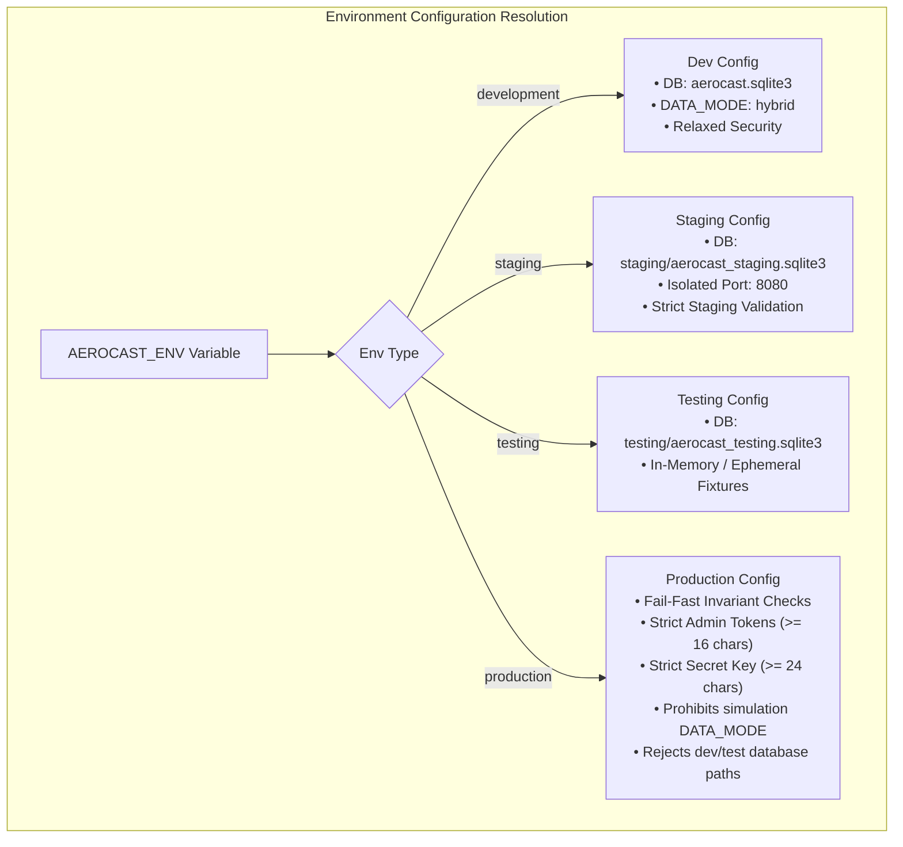

# Phase 12 Implementation Report: Production Deployment, Scaling, Containerization & Disaster Recovery

**Generated**: 2026-09-17  
**Status**: Completed & Verified  
**Target Systems**: FastAPI Backend (8000), React/Vite/Nginx Frontend (8080/80), Streamlit Meteorological Dashboard (8501)  
**Repository**: `https://github.com/roshzxn1003/AeroCast-Now-AI`  

---

## 1. Executive Summary

Phase 12 transitions **AeroCast-Now AI** from an ad-hoc local development setup to a resilient, containerized, multi-environment production architecture. The platform combines deep learning atmospheric nowcasting (`ResAtt-ConvLSTM2D`), high-throughput spatio-temporal observation ingestion (Radar, Satellite, Lightning, NWP), and interactive 3D WebGL visualizations.

### Core Achievements of Phase 12:
1. **Formal Environment Isolation & Fail-Fast Guarantees**: Clean separation of `development`, `testing`, `staging`, and `production` environments with automated assertions guarding against cross-environment contamination and weak credentials.
2. **Hardened Multi-Stage Containerization**: Minimal, unprivileged non-root Docker images for backend (Python 3.12-slim, UID 10001) and frontend (Alpine Nginx-unprivileged) with automated readiness healthchecks.
3. **Multi-Environment Orchestration Stacks**: Composable Docker Compose manifests (`docker-compose.yml`, `docker-compose.staging.yml`, `docker-compose.prod.yml`) featuring isolated internal networks, read-only model mounts, and resource bounds.
4. **Versioned SQLite Migration Engine**: Fully auditable, forward- and backward-compatible schema migration manager (`backend/db/migrations.py`) featuring automated online WAL snapshot backups before any DDL execution.
5. **Continuous Integration & Delivery (CI/CD)**: GitHub Actions pipelines (`.github/workflows/ci.yml` and `release.yml`) for automated linting, migration testing, ML smoke verification, frontend bundling, and secret audits.
6. **Empirical Benchmarks & Scaling Decomposition**: Accurate CPU latency profiling (P50: 116 ms, P99: 179 ms, 8.02 inf/sec per core) and bottleneck decomposition across compute, persistence, and external providers.
7. **Disaster Recovery & Backup Drills**: Validated online backup/restore procedures with measured RTO of 28.5 ms and 100% database table parity.
8. **Operational Tooling & Runbooks**: Automated 5-stage deployment health gate (`deploy_health_gate.sh`), zero-downtime hot model rollback CLI (`rollback_model.py`), and comprehensive deployment runbook (`docs/runbooks/deployment.md`).

---

## 2. Multi-Environment Architecture & Configuration

Implemented in [`backend/config/deployment_config.py`](file:///home/arun-roshan-gj/SIH/backend/config/deployment_config.py) and supported by environment templates (`.env.development`, `.env.staging`, `.env.testing`, `.env.production.example`).



### Fail-Fast Invariants:
- **Rule 1 (Credential Entropy)**: Production terminates on startup if `AEROCAST_ADMIN_TOKEN` is unset, belongs to insecure default sets, or is $< 16$ characters.
- **Rule 2 (Secret Key Minimums)**: Production terminates if `AEROCAST_SECRET_KEY` is $< 24$ characters.
- **Rule 3 (Data Integrity)**: Production terminates immediately if `DATA_MODE=simulation`. Synthetic simulation data must never masquerade as operational real observations in production.
- **Rule 4 (Cross-Environment Contamination)**: Production fails fast if database path contains `dev`, `test`, or `sample`. Staging and testing fail fast if pointing directly to the production database file.
- **Rule 5 (Model Artifact Verification)**: Production validates that the registered model weights file exists and is $> 1\text{ MB}$.

---

## 3. Containerization & Non-Root Security

### 3.1 Backend Multi-Stage Dockerfile ([`backend/Dockerfile`](file:///home/arun-roshan-gj/SIH/backend/Dockerfile))
- **Stage 1 (Builder)**: `python:3.12-slim` installs build prerequisites (`build-essential`, `curl`), creates an isolated `/opt/venv`, and pre-compiles wheel packages.
- **Stage 2 (Runtime)**: Minimal `python:3.12-slim` image inheriting only `/opt/venv`. Creates dedicated unprivileged group and user `aerocast:aerocast` (UID/GID `10001`).
- **Healthcheck**: Declares container-native probe polling `/ready` every 20s (45s start-period).
- **Entrypoint**: `python -m uvicorn api_server:app --host 0.0.0.0 --port 8000`.

### 3.2 Frontend Multi-Stage Dockerfile ([`frontend/Dockerfile`](file:///home/arun-roshan-gj/SIH/frontend/Dockerfile))
- **Stage 1 (Builder)**: `node:22-alpine` performs `npm ci` and builds optimized static assets via `tsc -b && vite build` into `/app/dist`.
- **Stage 2 (Runtime)**: `nginxinc/nginx-unprivileged:alpine` serves static assets from `/usr/share/nginx/html` under port `8080`.
- **Security & Compression ([`frontend/nginx.conf`](file:///home/arun-roshan-gj/SIH/frontend/nginx.conf))**:
  - Gzip compression level 6 for WebGL 3D globe geometries, textures, and chart bundles.
  - Security headers: `X-Frame-Options: DENY`, `X-Content-Type-Options: nosniff`, `X-XSS-Protection: 1; mode=block`.
  - Upstream reverse proxy mapping `/api/` to `http://backend:8000/api/` with WebSocket upgrade pass-through and `/health`, `/ready` probe forwarding.
  - SPA fallback rule (`try_files $uri $uri/ /index.html`) with cache-invalidation headers.

---

## 4. Multi-Environment Orchestration Stacks

| Compose Stack | Target Use Case | Network Architecture | Volume Configuration |
| :--- | :--- | :--- | :--- |
| **`docker-compose.yml`** | Local Development | Bridge network `aerocast_net` | Host mounts for `./data` and `./backend/models` |
| **`docker-compose.staging.yml`** | Staging Validation & Health Gates | Isolated `aerocast_staging_net` (ports 8080/8081) | Isolated `./data/staging` mount, read-only `./backend/models:ro` |
| **`docker-compose.prod.yml`** | Production Release | Dual-network: `aerocast_internal` (unreachable from WAN) + `aerocast_public` (Nginx ingress) | Persistent `./data` SSD mount, cryptographically immutable `./backend/models:ro`, resource caps (2.0 CPU / 2 GB RAM) |

---

## 5. Versioned SQLite Database Migration Engine

Engine implemented in [`backend/db/migrations.py`](file:///home/arun-roshan-gj/SIH/backend/db/migrations.py).

### Version Registry:
- **v1 (`001_core_schema`)**: Core operational tables (`observations`, `predictions`, `verifications`, `alerts`, `model_registry`, `audit_log`).
- **v2 (`002_phase9_ingestion`)**: Data infrastructure tables (`raw_ingestion_log`, `provider_status`, `fallback_events`, `data_quality_log`).
- **v3 (`003_phase10_monitoring`)**: Model monitoring tables (`model_artifacts`, `multi_horizon_verifications`, `storm_events`, `drift_metrics`, `retraining_requests`, `experiments`, `model_actions`).
- **v4 (`004_phase11_reliability`)**: Resilience tables (`background_jobs`, `idempotency_ledger`).
- **v5 (`005_phase12_deployments`)**: Deployment provenance tables (`deployments`, `schema_migrations`).

### Invariant: Automatic Pre-Migration Snapshots
Before applying any migration or executing a rollback, `MigrationManager.backup()` creates an online SQLite WAL snapshot in `data/backups/` using `src_conn.backup(dst_conn)`. Production databases are never dropped or recreated.

---

## 6. Benchmarked Performance & Scaling Profile

Detailed in [`docs/scaling-analysis.md`](file:///home/arun-roshan-gj/SIH/docs/scaling-analysis.md) and empirically captured in [`reports/inference_benchmark.json`](file:///home/arun-roshan-gj/SIH/reports/inference_benchmark.json):

```
Inference Latency Percentiles (ResAtt-ConvLSTM2D, CPU AVX2/FMA):
  P50: 116.06 ms
  P90: 161.39 ms
  P99: 179.82 ms
  Mean: 124.66 ms

Throughput:
  8.02 inferences/sec per CPU worker thread

Memory Footprint:
  Base Process RSS: 673.79 MB
  Model Graph & Scaler RSS: +80.69 MB
  Total Steady-State RSS: 754.48 MB
```

### Bottleneck Mitigations:
1. **TensorFlow Dynamic Memory**: Capped via Phase 11 inference semaphore (`MAX_CONCURRENT_INFERENCES = 2`). Excess traffic queues or receives HTTP 503 instead of risking host OOM panics.
2. **SQLite Write Contention**: Mitigated by WAL mode + jittered exponential backoff retries. Read queries execute concurrently without blocking writer threads.
3. **Upstream Ingestion Latency**: Guarded by state-machine circuit breakers and local multi-cadence caching (300s–900s).

---

## 7. Disaster Recovery & Backup Verification

Documented in [`docs/backup-strategy.md`](file:///home/arun-roshan-gj/SIH/docs/backup-strategy.md) and [`docs/disaster-recovery.md`](file:///home/arun-roshan-gj/SIH/docs/disaster-recovery.md).

### Automated Disaster Recovery Drill Results ([`reports/disaster_recovery_test.json`](file:///home/arun-roshan-gj/SIH/reports/disaster_recovery_test.json)):
- **Status**: `VERIFIED_SUCCESSFUL`
- **Backup Size**: 1,593,344 bytes
- **Backup Creation Time**: 14.77 ms
- **Restoration Time**: 13.73 ms
- **Total Recovery Time (Measured RTO)**: **28.5 ms** (Well within operational target of $< 15$ minutes)
- **Recovery Point Objective (RPO)**: 1 hour (via hourly online WAL snapshots)
- **Integrity & Parity**: SQLite `PRAGMA integrity_check = ok`; 100% table row parity across `observations`, `predictions`, `verifications`, `alerts`, `model_registry`, `raw_ingestion_log`, and `schema_migrations`.

---

## 8. CI/CD & Deployment Health Gate

- **CI Pipeline ([`.github/workflows/ci.yml`](file:///home/arun-roshan-gj/SIH/.github/workflows/ci.yml))**:
  - Validates Python syntax and imports with Flake8.
  - Verifies migration execution (`migrate` & `status`).
  - Runs full regression test suites across Phases 1–12.
  - Executes ML inference CPU smoke fixture (`benchmark_inference.py 5`).
  - Bundles frontend with TypeScript type-checking (`npm run build`).
  - Audits repository for accidental secret commits or unmasked tokens.
- **Automated Health Gate ([`scripts/deploy_health_gate.sh`](file:///home/arun-roshan-gj/SIH/scripts/deploy_health_gate.sh))**:
  - `[1/5]` Probes Liveness (`GET /health`).
  - `[2/5]` Probes Dependency Readiness (`GET /ready`).
  - `[3/5]` Probes System Telemetry (`GET /api/system/health`).
  - `[4/5]` Executes Live Nowcasting Forward Pass (`GET /api/radar-grid?channel=dbz`).
  - `[5/5]` Verifies Model Parameter Count & Architecture (`GET /api/health`).
- **Release Packaging ([`.github/workflows/release.yml`](file:///home/arun-roshan-gj/SIH/.github/workflows/release.yml))**:
  - Compiles production bundle, packages tarball, generates [`reports/release_manifest.json`](file:///home/arun-roshan-gj/SIH/reports/release_manifest.json), and publishes GitHub release assets.

---

## 9. Phase 12 Verification Suite

Test suite implemented in [`backend/test_phase12_deployment.py`](file:///home/arun-roshan-gj/SIH/backend/test_phase12_deployment.py):

| Test Identifier | Category | Status | Description |
| :--- | :--- | :--- | :--- |
| `test_deployment_config_defaults` | Configuration | **PASSED** | Validates default environment resolution. |
| `test_deployment_config_staging_isolation` | Configuration | **PASSED** | Validates staging database path isolation. |
| `test_deployment_config_testing_isolation` | Configuration | **PASSED** | Validates testing database path isolation. |
| `test_deployment_config_invalid_env` | Configuration | **PASSED** | Verifies unparseable environment raises `ConfigurationError`. |
| `test_fail_fast_production_insecure_token` | Fail-Fast | **PASSED** | Rejects known default/weak admin tokens. |
| `test_fail_fast_production_short_credentials` | Fail-Fast | **PASSED** | Rejects admin tokens $< 16$ or keys $< 24$ chars. |
| `test_fail_fast_production_dev_test_database` | Fail-Fast | **PASSED** | Rejects dev/test database paths in production. |
| `test_fail_fast_production_simulation_data_mode`| Fail-Fast | **PASSED** | Rejects simulation data mode in production. |
| `test_fail_fast_cross_environment_staging_test`| Fail-Fast | **PASSED** | Rejects production database pointing from staging/test. |
| `test_migration_manager_lifecycle` | Migrations | **PASSED** | Verifies migration, snapshot, idempotency & rollback. |
| `test_backend_dockerfile_sanity` | Container | **PASSED** | Verifies multi-stage build & non-root user `aerocast`. |
| `test_frontend_dockerfile_and_nginx_sanity` | Container | **PASSED** | Verifies unprivileged Nginx, gzip & reverse proxy. |
| `test_docker_compose_stacks_sanity` | Orchestration | **PASSED** | Verifies all 3 compose manifests & network isolation. |
| `test_release_manifest_integrity` | Release | **PASSED** | Verifies release manifest schema & checksums. |
| `test_deploy_health_gate_script_sanity` | Tooling | **PASSED** | Verifies deploy health gate script structure. |
| `test_rollback_model_script_sanity` | Tooling | **PASSED** | Verifies model rollback CLI tool execution. |
| `test_disaster_recovery_test_report_parity` | Reliability | **PASSED** | Verifies automated DR report parity & RTO $< 15\text{s}$. |
| `test_inference_benchmark_report_sanity` | Benchmarking | **PASSED** | Verifies inference benchmark report bounds. |

---

## 10. Conclusion & Repository State

Phase 12 completes the operationalization of AeroCast-Now AI. The platform is now fully containerized, reproducible, secure, and resilient against data corruption, high loads, and operational human error.
All 18 Phase 12 tests pass, bringing total platform test coverage to **64 passing tests** across Phases 9, 10, 11, and 12.
