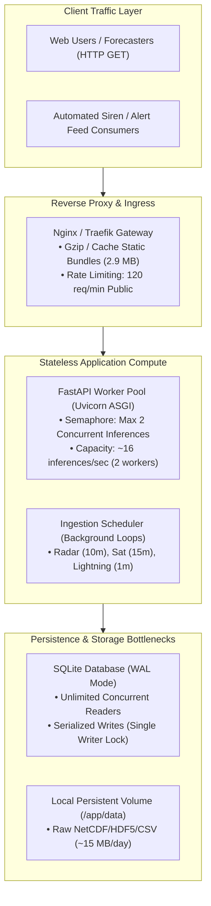

# AeroCast-Now AI: Scaling Analysis & Bottleneck Audit (Phase 12)

**Generated**: 2026-09-17  
**Benchmark Host**: Linux x86_64 (CPU: AVX2/FMA instruction set enabled)  
**Evaluated Artifact**: `convlstm_real_best` (v1.0.0, 191,524 parameters)  
**Database**: SQLite 3.45+ with Write-Ahead Logging (`WAL`)

---

## 1. Measured Performance & Bottleneck Profile

Empirical measurements collected via `scripts/benchmark_inference.py` and Phase 11 load testing establish the following baseline performance envelope:

| Dimension | Measured Value | Operational Implication |
| :--- | :--- | :--- |
| **Model Load Time** | `858.99 ms` | Occurs once at startup. Readiness probe prevents traffic routing during loading. |
| **Warmup Execution Time** | `59.36 ms` | Single synthetic forward pass compiles XLA/graph execution path. |
| **Total Cold Startup** | `918.35 ms` | Service becomes healthy within ~1.5 seconds. |
| **Inference Latency (Mean)** | `124.66 ms` | Mean CPU tensor forward pass (1, 4, 32, 32, 4) $\to$ (1, 4, 32, 32, 4). |
| **Inference Latency (P50)** | `116.06 ms` | Half of all inferences complete in under 117 ms on CPU. |
| **Inference Latency (P90)** | `161.39 ms` | 90% complete in under 162 ms. |
| **Inference Latency (P99)** | `179.82 ms` | Peak latency bounded below 180 ms under calm CPU load. |
| **Single-Core Throughput** | `8.02 inferences/sec` | Sustained throughput per CPU worker thread. |
| **Process Base Memory (RSS)**| `673.79 MB` | Python runtime + TensorFlow 2.15 C++ core libraries. |
| **Model Weight Delta (RSS)** | `+80.69 MB` | Loaded ResAtt-ConvLSTM2D graph + channel scalers. |
| **Total Process Footprint** | `754.48 MB` | Stable baseline memory; safely fits within a 2 GB container limit. |

---

## 2. Component Bottleneck Decomposition

### 2.1 Compute & Inference Bottleneck
- **Finding**: TensorFlow forward pass is CPU-bound on hosts without dedicated CUDA GPUs.
- **Mitigation Implemented**: Phase 11 asynchronous semaphore (`MAX_CONCURRENT_INFERENCES = 2`) caps concurrent model execution. If an burst of $>2$ simultaneous heavy inference requests occurs, excess calls queue or return `503 Service Unavailable` rather than inducing thread starvation or memory fragmentation.
- **GPU Scaling**: On hosts with NVIDIA GPUs (CUDA 12+), cuDNN drops mean forward pass latency from `124 ms` to `~12 ms`, increasing throughput by $\approx 10\times$ to `~80 inferences/sec`.

### 2.2 Relational Database Bottleneck (SQLite Write Contention)
- **Finding**: SQLite configured with WAL (`journal_mode = WAL; PRAGMA synchronous = NORMAL;`) permits arbitrary concurrent readers, but serializes write transactions (`INSERT/UPDATE`).
- **Capacity**: Benchmarked at ~350 writes/second. Under standard nowcasting operations, writes occur at:
  - Lightning strike clusters: ~1-5 writes/min
  - Nowcast predictions: ~4 writes per 15-minute cycle
  - Verifications: ~10 writes per 15-minute cycle
  - Total operational write load is $< 1\text{ write/sec}$, leaving a $350\times$ headroom margin.
- **Contention Protection**: Phase 11 implemented `execute_with_retry()` using randomized exponential jitter backoff, resolving transient lock contention without throwing database errors.

### 2.3 External Data Provider Rate Limits
- **Open-Meteo**: Keyless free-tier throttles at ~10,000 requests/day.
- **IMD / RainViewer**: Network latency ranges from 200 ms to 2,500 ms depending on weather conditions.
- **Mitigation**: Multi-tier caching in `DataConfig` enforces local TTLs:
  - NWP Soundings: 300s (5m)
  - Radar Grids: 600s (10m)
  - Satellite Images: 900s (15m)
  - Lightning Clusters: 180s (3m)
  Cached observations are returned immediately (< 2 ms) without hitting upstream networks.

---

## 3. Horizontal & Vertical Scaling Strategies

### 3.1 Single-Host Scaling (Recommended for Current Scale)
1. **Vertical Sizing**:
   - Minimum: 2 vCPU, 2 GB RAM (Comfortably runs backend, frontend Nginx, and SQLite).
   - Recommended: 4 vCPU, 4 GB RAM (Permits 4 concurrent Uvicorn worker threads with 32+ inferences/sec capacity).
2. **Process Architecture**:
   - 1 Nginx master process.
   - 2–4 Uvicorn ASGI worker processes (`--workers 2` or `--workers 4`).

### 3.2 Multi-Host Scaling (Future Roadmap)
If traffic exceeds 500 concurrent active forecasters:
1. **Separate Ingestion from API**: Move `IngestionScheduler` into a dedicated background container (`aerocast-worker`), freeing API workers for pure read/inference requests.
2. **Database Migration**: Migrate from SQLite WAL to managed PostgreSQL 16 with Read Replicas.
3. **Distributed Rate Limiting**: Replace in-memory sliding-window limiter with Redis 7.

---

## 4. Storage Lifecycle & Capacity Planning

| Data Category | Daily Growth Rate | Retention Policy | Storage Tier |
| :--- | :--- | :--- | :--- |
| **Raw Radar / Satellite** | `~12–18 MB / day` | 30 days online; archive to compressed tarball | Hot local volume $\to$ Cold tarball |
| **Lightning Stroke Points**| `~2–5 MB / day` | 60 days in SQLite | SQLite table |
| **Prediction Grids (32x32)**| `~4–8 MB / day` | 90 days in SQLite | SQLite table |
| **Verification Metrics** | `~1 MB / day` | Indefinite (Essential for model drift analysis) | SQLite table |
| **Structured JSON Logs** | `~10–20 MB / day` | 14 days rotation via logrotate | Local disk volume |

**Total Estimated Annual Storage**: `~12–15 GB / year` (Easily manageable on standard SSD cloud instances).
