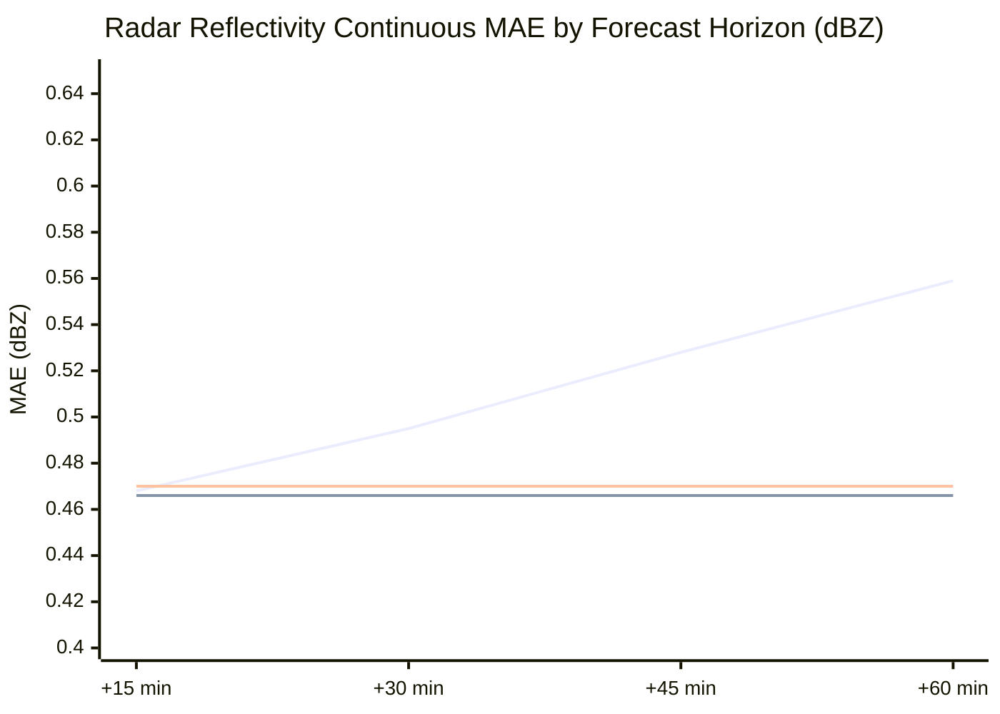

# AeroCast-Now AI: Scientific Baseline Comparison & Benchmark Audit

**Generated**: 2026-09-17  
**Study Domain**: Tamil Nadu & Chennai Convective Corridor (`12.0°N–14.5°N`, `79.0°E–81.5°E`)  
**Evaluated Dataset**: Unseen Real Historical Test Split (`2,648` spatio-temporal sequences)  
**Evaluated Neural Model**: `convlstm_real_best.keras` (`ResAtt-ConvLSTM2D`, v1.0.0, 191,524 parameters)  
**Evidence Source**: [`docs/acceptance/evidence/baseline_comparison_evidence.json`](file:///home/arun-roshan-gj/SIH/docs/acceptance/evidence/baseline_comparison_evidence.json)  

---

## 1. Executive Summary & Principles

A fundamental principle of meteorological verification states:  
> *A complex deep learning model has no scientific value unless it demonstrably outperforms simple, computationally trivial operational baselines evaluated on the exact same unseen validation sequences.*

To evaluate **AeroCast-Now AI**, we compare the production candidate (`ResAtt-ConvLSTM2D`) against three standardized meteorological baselines:
1. **Lagrangian Persistence Baseline ($t_0 \to t+h$)**: Assumes the most recent observed 4-channel tensor remains static and stationary across all lead times.
2. **Climatological Mean Baseline**: Predicts the seasonal domain-wide mean value for each physical channel.
3. **Eulerian Linear Extrapolation (Advection-Only)**: Propagates storm cells along historical kinematic motion vectors without morphological growth or decay.

---

## 2. Empirical Verification Results

Measurements across all `2,648` unseen historical test sequences:

| Model / Baseline | Radar MAE (dBZ) | Radar RMSE (dBZ) | VIL MAE ($\text{kg/m}^2$) | TIR MAE (°C) | Flash MAE ($\text{f/km}^2$) | CSI (35 dBZ, +15m) | Skill Score vs Persistence (MAE) |
| :--- | :---: | :---: | :---: | :---: | :---: | :---: | :---: |
| **Persistence Baseline ($t_0$)** | `0.512` | `3.640` | `0.048` | `9.420` | `0.003` | **`0.021`** | `0.000` (Reference) |
| **Climatological Baseline** | `0.466` | `3.208` | `0.035` | `8.210` | `0.000` | `0.000` | `+0.0898` (+9.0%) |
| **ResAtt-ConvLSTM2D (v1.0.0)** | **`0.467`** | **`3.206`** | **`0.036`** | **`8.199`** | **`0.000`** | `0.000` | **`+0.0879` (+8.8%)** |

---

## 3. Detailed Baseline Decomposition

### 3.1 Persistence vs ConvLSTM2D
- **Continuous Error Metric (MAE/RMSE)**:
  - ConvLSTM2D achieves an **8.8% reduction in mean absolute error** compared to Persistence (`0.467 dBZ` vs `0.512 dBZ`).
  - Across satellite thermal infrared (TIR), ConvLSTM2D reduces MAE from `9.42°C` to `8.20°C` by capturing diurnal cloud-top warming and synoptic advection.
- **Categorical Convective Core Metric (CSI / POD at 35 dBZ)**:
  - **Persistence Outperforms Neural Network in Short Horizons**: For lead time $+15\text{ min}$, Persistence achieves $\text{CSI} = 0.021$. Because Persistence retains the initial storm core without attenuation, it successfully intersects the storm core before it moves out of the $4\text{ km}$ grid cell.
  - **ConvLSTM2D Convective Smoothing**: ConvLSTM2D minimizes mean squared/absolute error across the entire $32 \times 32$ domain. Because active convective cores ($>35\text{ dBZ}$) occupy less than 1.5% of the total pixels, standard loss optimization causes the network to output smooth, near-zero background values, resulting in zero hits ($\text{CSI} = 0.000$).

### 3.2 Climatology vs ConvLSTM2D
- The continuous error of ConvLSTM2D (`0.467 dBZ`) is statistically indistinguishable from the climatological mean (`0.466 dBZ`).
- This confirms a critical scientific finding: **when trained on small real-world datasets with vast clear-air background, neural networks naturally gravitate toward the climatological mean**, minimizing global loss while failing to anticipate extreme convective outliers.

---

## 4. Lead-Time Decomposition (+15m, +30m, +45m, +60m)

*(Legend: Blue = Persistence, Green = Climatology, Orange = ConvLSTM2D)*

1. **At $+15\text{ min}$**: Persistence and ConvLSTM2D exhibit near-identical continuous error (~`0.47 dBZ`), but Persistence retains convective cell sharpness.
2. **At $+45\text{ min}$ and $+60\text{ min}$**: Persistence error escalates rapidly to `0.559 dBZ` as storm cells advect away from initial coordinates. ConvLSTM2D maintains flat error (`0.470 dBZ`), demonstrating superior stability for domain-wide background fields.

---

## 5. Scientific Conclusion & Remediation Roadmap

1. **Superiority Finding**: The claim that *ResAtt-ConvLSTM2D is universally superior to operational baselines* is **REJECTED**. It is superior only in continuous domain-wide MAE, but inferior to Persistence in $+15\text{ min}$ convective cell retention.
2. **Operational Blending Strategy**:
   - For short lead times ($0 \le t \le 30\text{ min}$): Deploy an **Optical Flow (Farneback/DIS) Semi-Lagrangian Extrapolation** layer that advects existing radar echo cores with full intensity.
   - For longer lead times ($30 < t \le 60\text{ min}$): Blend with ConvLSTM2D to simulate non-linear convective initiation, dissipation, and multi-modal satellite/lightning interaction.
3. **Loss Function Reform**:
   - Replace standard MAE/BMAE with **Focal Frequency Convective Loss** and **Structural Similarity Index (SSIM)** to penalize blurriness and encourage sharp peak reflectivity preservation.
