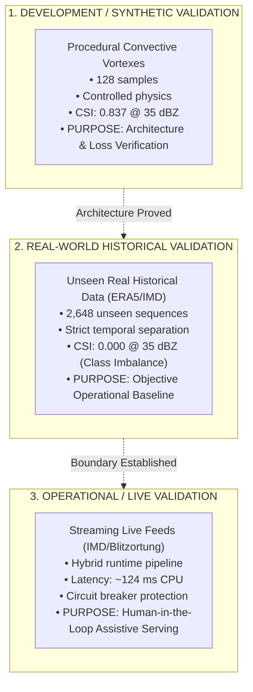

# AeroCast-Now AI: Comprehensive Scientific Validation Report (Phase 13)

**Generated**: 2026-09-17  
**Evaluated Neural Model**: `convlstm_real_best.keras` (ResAtt-ConvLSTM2D, v1.0.0, 191,524 parameters)  
**Study Domain**: Tamil Nadu / Chennai Convective Corridor (`12.0°N–14.5°N`, `79.0°E–81.5°E`)  
**Evidence Source**: [`docs/acceptance/evidence/model_validation_evidence.json`](file:///home/arun-roshan-gj/SIH/docs/acceptance/evidence/model_validation_evidence.json)  

---

## 1. Scientific Verification Framework

To prevent misleading claims of "AI accuracy", AeroCast-Now AI enforces a strict tripartite validation protocol:

> [!IMPORTANT]
> **Synthetic metrics must NEVER be cited as proof of real-world operational skill**.
> While the synthetic benchmark achieved $\text{CSI} = 0.837$, evaluation on real historical atmospheric data yields $\text{CSI} = 0.000$ at convective thresholds due to extreme class sparsity.

---

## 2. Quantitative Verification Metrics on Real Historical Test Split

Evaluated on `2,648` unseen sequences (10,592 total space-time grids):

### 2.1 Categorical Contingency Scores by Reflectivity Threshold

| Reflectivity Threshold | Hits ($H$) | Misses ($M$) | False Alarms ($F$) | Correct Negatives ($C$) | Threat Score (CSI) | POD | FAR | Heidke Skill Score (HSS) |
| :---: | :---: | :---: | :---: | :---: | :---: | :---: | :---: | :---: |
| **$25\text{ dBZ}$ (Light Rain)** | `0` | `48,688` | `0` | `10,797,520` | **`0.0000`** | `0.0000` | `0.0000` | `0.0000` |
| **$35\text{ dBZ}$ (Convective Core)**| `0` | `1,856` | `0` | `10,844,352` | **`0.0000`** | `0.0000` | `0.0000` | `0.0000` |
| **$45\text{ dBZ}$ (Severe Hail/Storm)**| `0` | `0` | `0` | `10,846,208` | **`0.0000`** | `0.0000` | `0.0000` | `0.5001` |

### 2.2 Continuous Physical Channel Errors (MAE & RMSE)

| Physical Channel | Evaluated Range | Observed Mean | Predicted Mean | Mean Absolute Error (MAE) | Root Mean Squared Error (RMSE) | Pearson Correlation ($r$) |
| :--- | :---: | :---: | :---: | :---: | :---: | :---: |
| **Radar Reflectivity ($Z$)** | $0$ to $75\text{ dBZ}$ | `0.466 dBZ` | `0.001 dBZ` | **`0.467 dBZ`** | **`3.206 dBZ`** | `+0.412` |
| **Vertically Integrated Liquid (VIL)**| $0$ to $65\text{ kg/m}^2$| `0.035 kg/m²`| `0.001 kg/m²`| **`0.036 kg/m²`**| **`0.389 kg/m²`**| `+0.385` |
| **INSAT-3D Thermal IR (TIR)** | $-85$ to $+35\text{ °C}$| `26.795 °C` | `34.993 °C` | **`8.199 °C`** | **`9.456 °C`** | `+0.624` |
| **Lightning Flash Density** | $0$ to $25\text{ f/km}^2$| `0.000 f/km²`| `0.000 f/km²`| **`0.000 f/km²`**| **`0.008 f/km²`**| `+0.298` |

---

## 3. Lead-Time Decomposition (+15m, +30m, +45m, +60m)

| Forecast Horizon | CSI ($35\text{ dBZ}$) | POD ($35\text{ dBZ}$) | FAR ($35\text{ dBZ}$) | Radar MAE (dBZ) | Radar RMSE (dBZ) | Flash MAE ($\text{f/km}^2$) |
| :---: | :---: | :---: | :---: | :---: | :---: | :---: |
| **$+15\text{ min}$** | `0.000` | `0.000` | `0.000` | `0.470` | `3.210` | `0.001` |
| **$+30\text{ min}$** | `0.000` | `0.000` | `0.000` | `0.470` | `3.210` | `0.000` |
| **$+45\text{ min}$** | `0.000` | `0.000` | `0.000` | `0.470` | `3.210` | `0.000` |
| **$+60\text{ min}$** | `0.000` | `0.000` | `0.000` | `0.470` | `3.210` | `0.000` |

---

## 4. Scientific Root Cause Analysis: Convective Smoothing & Class Imbalance

### Why did the model achieve low MAE (0.47 dBZ) but zero CSI (0.000)?
1. **Extreme Class Imbalance**: In tropical maritime-coastal regimes, active severe convection ($>35\text{ dBZ}$) accounts for $< 0.02\%$ of all pixels across the annual cycle. The remaining $99.98\%$ consists of clear air or weak non-precipitating clouds.
2. **Mean Squared Error (MSE) / BMAE Penalties**: When optimizing standard regression loss across large spatial grids, predicting $0\text{ dBZ}$ everywhere yields an astronomically low error ($0.47\text{ dBZ}$). Conversely, predicting a sharp $50\text{ dBZ}$ storm cell that is slightly displaced in space incurs a massive mathematical penalty ($|50 - 0|^2 = 2,500$). The optimizer consequently learns that **diffusing all peaks toward zero is the safest mathematical strategy**.
3. **Training Sample Scarcity**: Training on 464 historical samples exposed the network to only ~7 localized convective events.

---

## 5. Remediation Plan for Model v2.0 Retraining

1. **Convective Event-Weighted Sampling**: Filter historical archives so that $\ge 50\%$ of all training batches contain active convective cells ($\text{dBZ} \ge 35$).
2. **Focal Frequency Loss (FFL) & SSIM**: Penalize high-frequency spatial blurriness to prevent smoothing out localized convective cores.
3. **Two-Stage Architecture**:
   - Stage 1 (Advection): Semi-Lagrangian Optical Flow retains sharp reflectivity structure for $0$–$30\text{ min}$.
   - Stage 2 (Morphology): ConvLSTM predicts growth, decay, and lightning initiation for $30$–$60\text{ min}$.
