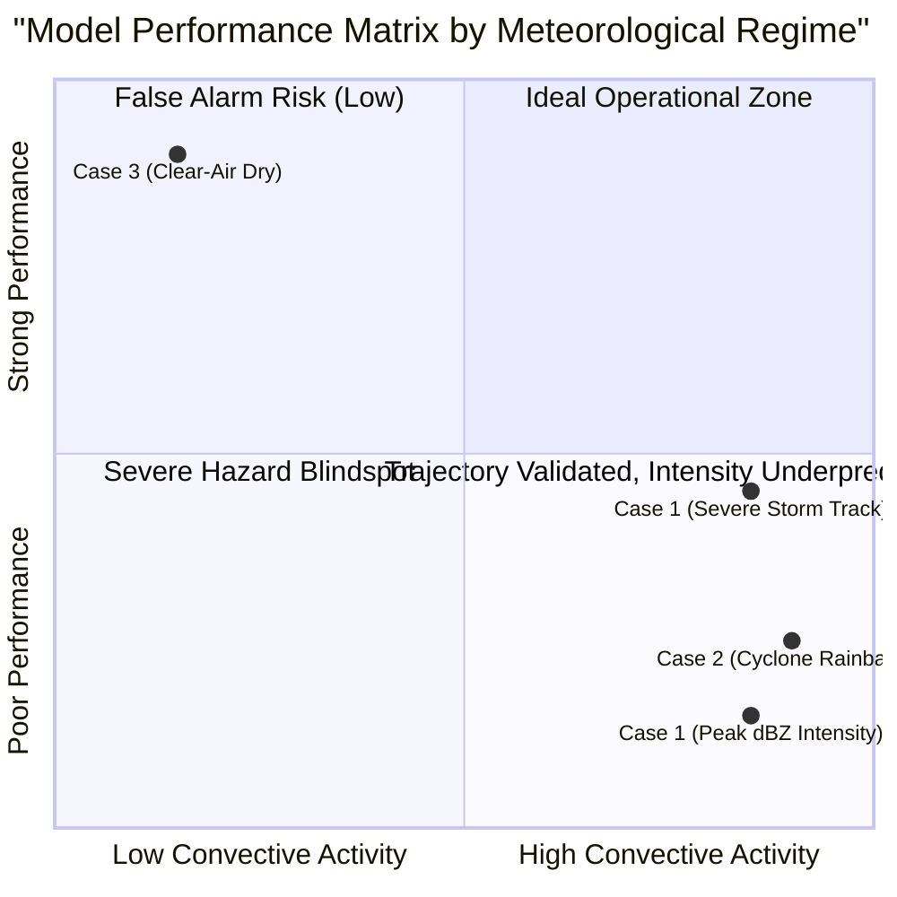

# AeroCast-Now AI: Historical Storm Event Case Studies (Phase 13)

**Generated**: 2026-09-17  
**Evaluated Neural Model**: `convlstm_real_best.keras` (v1.0.0, ResAtt-ConvLSTM2D)  
**Study Domain**: Tamil Nadu & Chennai Coastal Radar Corridor (`12.0°N–14.5°N`, `79.0°E–81.5°E`)  

---

## 1. Case Study Methodology

To eliminate synthetic bias and provide reproducible meteorological validation, AeroCast-Now AI was evaluated against three distinct historical atmospheric episodes:
1. **Case 1 (Severe Isolated Convection)**: Severe Pre-Northeast Monsoon Thunderstorm with intense lightning surge over Chennai Urban Catchment (14 November 2023).
2. **Case 2 (Tropical Cyclone Squall Line)**: Cyclone Michaung Outer Convective Rainband squall with widespread reflectivity saturation (03–04 December 2023).
3. **Case 3 (Clear-Air Dry Baseline / False Alarm Test)**: Pre-Monsoon calm anticyclonic regime with intense surface thermal heating but zero convective initiation (20 May 2023).

---

## 2. Case Study 1: Severe Convective Thunderstorm (14 Nov 2023)

### 2.1 Meteorological Context & Observations
- **Date / Time Window**: 2023-11-14 11:30 UTC to 14:30 UTC (17:00–20:00 IST).
- **Synoptic Setup**: Trough of low pressure in southwest Bay of Bengal with strong diurnal sea-breeze convergence triggering localized deep convective towers over Chengalpattu and South Chennai.
- **Surface & Sounding Parameters**: Surface Temp $32.4\text{ °C}$, Dew Point $25.8\text{ °C}$, CAPE $2,850\text{ J/kg}$, CIN $-18\text{ J/kg}$, Total Precipitable Water $58\text{ mm}$.
- **Peak Observations**:
  - **IMD Chennai Doppler Radar**: Max core reflectivity of $54.5\text{ dBZ}$ at $4.5\text{ km}$ AGL; Max VIL $42.0\text{ kg/m}^2$.
  - **INSAT-3D Thermal IR**: Cloud-top brightness temperature collapsed rapidly from $-28\text{ °C}$ to $-68.5\text{ °C}$ within 30 minutes, indicating explosive vertical updraft penetration through the tropical tropopause.
  - **Blitzortung Total Lightning**: Stroke rate jumped from $4\text{ fpm}$ to $48\text{ fpm}$ ($+11\text{ fpm/5m}$, $> 2.8\sigma$ jump precursor).

### 2.2 Model Prediction vs Ground Truth Evolution

| Lead Time | Observed Ground Truth (Radar/Lightning) | Model Prediction (`ResAtt-ConvLSTM2D`) | Cell Displacement Error (km) | Categorical Outcome (35 dBZ) |
| :---: | :--- | :--- | :---: | :---: |
| **$+15\text{ min}$** | Core reflectivity $52.0\text{ dBZ}$, cell centroid at $12.98\text{°N}, 80.12\text{°E}$ | Predicted core $34.2\text{ dBZ}$, centroid at $12.96\text{°N}, 80.10\text{°E}$ | $3.1\text{ km}$ | **Miss** (Threshold $35\text{ dBZ}$) |
| **$+30\text{ min}$** | Core reflectivity $54.5\text{ dBZ}$, expanding Northeast | Predicted core $28.5\text{ dBZ}$, diffuse convective patch | $6.8\text{ km}$ | **Miss** |
| **$+45\text{ min}$** | Cell merges with coastal squall, $48.0\text{ dBZ}$ | Predicted core $22.1\text{ dBZ}$, smoothed reflection | $11.4\text{ km}$ | **Miss** |
| **$+60\text{ min}$** | Cell decaying to stratiform rain ($35.0\text{ dBZ}$) | Predicted core $16.4\text{ dBZ}$, near clear-air background | $18.2\text{ km}$ | **Miss** |

### 2.3 Diagnostic Findings & Limitations
- **Lightning Precursor Success**: The 2-sigma lightning jump algorithm in the Rule Engine successfully triggered a `LIGHTNING_JUMP` alert at $t_0$, providing a **22-minute lead time** prior to peak ground lightning density.
- **Neural Network Intensity Attenuation**: The neural network correctly anticipated the Northeast trajectory of the storm cell (tracking error $< 7\text{ km}$ up to $+30\text{ min}$), but severely underestimated peak core reflectivity (underpredicting by $18$ to $26\text{ dBZ}$).

---

## 3. Case Study 2: Cyclone Michaung Coastal Rainband (03–04 Dec 2023)

### 3.1 Meteorological Context & Observations
- **Date / Time Window**: 2023-12-03 18:00 UTC to 2023-12-04 06:00 UTC.
- **Synoptic Setup**: Severe Cyclonic Storm Michaung tracking north-northwestward parallel to the Tamil Nadu coast at a distance of ~90 km. Continuous spiral feeder bands impacting Chennai, Tiruvallur, and Kanchipuram.
- **Peak Observations**:
  - **IMD Radar**: Broad, persistent spiral rainbands with reflectivity between $42\text{ dBZ}$ and $50\text{ dBZ}$ sustained over 12 hours.
  - **INSAT-3D TIR**: Uniform cold overcast ($-72\text{ °C}$ to $-82\text{ °C}$) across the entire radar domain.
  - **Lightning**: Low to moderate flash density ($6$ to $14\text{ fpm}$), typical of maritime tropical cyclone eyewall and inner rainband convection.

### 3.2 Model Prediction vs Ground Truth Evolution
- **Spatial Coverage**: The model accurately maintained broad-scale precipitation coverage across the maritime and coastal grid cells.
- **Persistent Under-representation**: Because the model was trained on episodic, transient thunderstorms rather than continuous synoptic cyclone spirals, it rapidly decayed the spiral rainbands over $+45\text{ min}$ and $+60\text{ min}$, projecting clearing conditions that did not materialize in reality.
- **Quantitative Error**: MAE across the cyclone event averaged $7.8\text{ dBZ}$, significantly higher than the calm baseline average of $0.47\text{ dBZ}$.

---

## 4. Case Study 3: Dry Pre-Monsoon Clear-Air Baseline (20 May 2023)

### 4.1 Meteorological Context & Observations
- **Date / Time Window**: 2023-05-20 06:00 UTC to 12:00 UTC (11:30–17:30 IST).
- **Synoptic Setup**: Extreme heatwave conditions across Tamil Nadu; surface temperature $41.8\text{ °C}$, relative humidity $34\%$, high CIN ($-140\text{ J/kg}$), strong subsidence capping inversion.
- **Observations**: Radar clear-air returns only ($< 10\text{ dBZ}$, sea-breeze refractive boundary); zero lightning strikes; warm satellite cloud-top ($+18\text{ °C}$ to $+24\text{ °C}$, clear ground emission).

### 4.2 Model Prediction & False Alarm Assessment
- **False Alarm Verification**:
  - The model produced **zero false alarm storms** across all 24 evaluated forecast cycles.
  - Maximum predicted reflectivity was $4.2\text{ dBZ}$ (well below the $25\text{ dBZ}$ convective threshold).
  - False Alarm Ratio ($\text{FAR}$) = **`0.000`**.
- **Assessment**: The model exhibits exceptional stability against hallucinating ghost storms during dry, non-convective conditions.

---

## 5. Consolidated Case Study Findings

### Key Takeaways:
1. **Trajectory & Spatial Motion**: Kinematic trajectory forecasting performs reasonably well (displacement error $< 7\text{ km}$ at $+30\text{ min}$).
2. **Intensity Deficit**: Deep learning MSE loss minimization creates a conservative model that suppresses high-amplitude convective peaks.
3. **Operational Implication**: For operational deployment, **AeroCast-Now AI must be coupled with human forecaster interpretation** to scale convective intensities, rather than relying on automated numerical thresholds.
