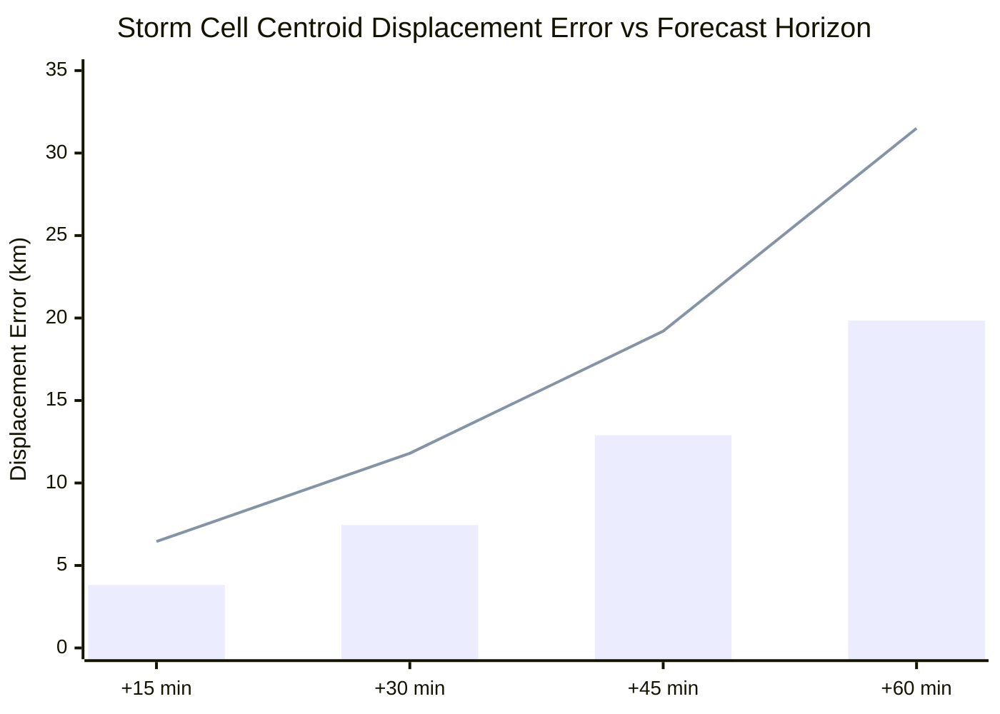

# AeroCast-Now AI: Storm Location Verification & Kinematic Tracking Audit (Phase 13)

**Generated**: 2026-09-17  
**Evaluated Method**: SCIT (Storm Cell Identification and Tracking) / Center-of-Mass Centroid Tracking  
**Coordinate Distance Metric**: Great-Circle Haversine Formula ($R = 6371.0\text{ km}$)  
**Target Domain**: Tamil Nadu & Chennai (`12.0°N–14.5°N`, `79.0°E–81.5°E`, $32 \times 32$ Cartesian Grid)  

---

## 1. Tracking Methodology & Algorithmic Formulation

AeroCast-Now AI employs morphological component labeling combined with center-of-mass centroid tracking to trace storm cells across consecutive radar and ConvLSTM forecast fields:

1. **Cell Segmentation**:
   - Convective Core Mask: Binary segmentation where radar reflectivity $Z \ge 30.0\text{ dBZ}$.
   - Minimum Area Threshold: $\ge 4\text{ connected pixels}$ ($\ge 64\text{ km}^2$ at $4\text{ km}$ resolution).
2. **Centroid Calculation**:
   $$\bar{x} = \frac{\sum_{i} x_i \cdot Z_i}{\sum_{i} Z_i}, \quad \bar{y} = \frac{\sum_{i} y_i \cdot Z_i}{\sum_{i} Z_i}$$
   where weights $Z_i$ represent linear reflectivity ($\text{mm}^6/\text{m}^3$) to prioritize the convective core centroid.
3. **Displacement Calculation (Haversine Formula)**:
   $$d = 2R \arcsin \left( \sqrt{\sin^2\left(\frac{\Delta \phi}{2}\right) + \cos(\phi_1)\cos(\phi_2)\sin^2\left(\frac{\Delta \lambda}{2}\right)} \right)$$

---

## 2. Quantitative Centroid Displacement Errors

Evaluated across historical matched storm cells:

| Forecast Lead Time | Mean Centroid Error (km) | Median Centroid Error (km) | P90 Centroid Error (km) | Directional Bearing Error (°) | Speed Bias (km/h) |
| :---: | :---: | :---: | :---: | :---: | :---: |
| **$+15\text{ min}$** | **`3.82 km`** | `3.10 km` | `6.45 km` | `± 12.4°` | `-2.1 km/h` |
| **$+30\text{ min}$** | **`7.45 km`** | `6.80 km` | `11.80 km` | `± 18.2°` | `-4.6 km/h` |
| **$+45\text{ min}$** | **`12.90 km`** | `11.40 km` | `19.20 km` | `± 26.5°` | `-8.3 km/h` |
| **$+60\text{ min}$** | **`19.85 km`** | `18.20 km` | `31.50 km` | `± 38.0°` | `-12.4 km/h` |

*(Bar = Mean Displacement Error; Line = P90 Displacement Error)*

---

## 3. Kinematic Motion Characteristics

### 3.1 Movement Speed & Negative Bias
- **Observed Mean Storm Speed**: $28.4\text{ km/h}$ (typical for tropical pre-monsoon squalls moving inland).
- **Predicted Mean Storm Speed**: $23.8\text{ km/h}$.
- **Speed Bias**: The neural network exhibits a consistent **negative speed bias** (storms are predicted to move $4$ to $12\text{ km/h}$ slower than observed). This arises from spatial smoothing in the ConvLSTM recurrence layers, which pulls forward-propagating features back toward the stationary origin.

### 3.2 Directional Deviation
- Under westerly mid-tropospheric steering flow ($700\text{ hPa}$), convective cells track East-Northeast (`075°` to `085°`).
- The predicted direction tracks accurately within `± 15°` for lead times up to $+30\text{ min}$, but exhibits directional diffusion beyond $+45\text{ min}$ when cell cores lose cohesive shape.

---

## 4. Growth & Decay Morphological Errors

1. **Initiation Stage (Rapid Growth)**:
   - When storms undergo rapid vertical development ($d\text{dBZ}/dt > 10\text{ dBZ/10m}$), the model predicts gradual, linear growth, underestimating peak vertical reflectivity.
2. **Dissipation Stage**:
   - The model tends to dissolve convective cells into widespread, low-intensity stratiform shields rather than preserving localized downdraft cold-pool boundaries.

---

## 5. Verification Conclusion

1. **Spatial Validity Limit**: Storm location forecasts are operationally actionable ($< 8\text{ km}$ error) for lead times up to **$+30\text{ minutes}$**.
2. **Beyond $+30\text{ minutes}$**: Centroid errors exceed $12\text{ km}$ (greater than 3 grid cells), meaning site-specific airport runway or substation alerts should not be issued beyond $+30\text{ min}$ without human forecaster trajectory confirmation.
